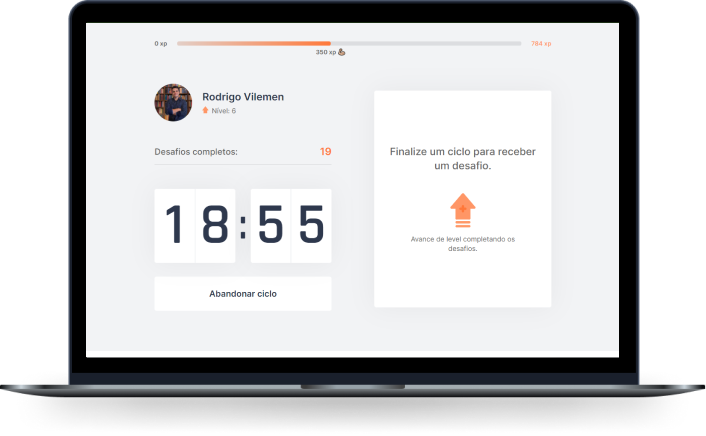

<h1 align="center">
  
</h1>

  

   Aja, se mecha, mude seu comportamento físico para obter um melhor desempenho dentro do seu trabalho, além de obter mais saúde para seu corpo e produtividade no trabalho, sua experiência no cotidiano será bem mais empolgante !
   O Re.aja é um app que une a técnica de Pomodoro com a realização de exercícios físicos para quem passa muito tempo na frente do computador.
   
   ---

### Qual o objetivo do Re.aja ?

   Fazer com que você não fique muito tempo parado na frente da tela do monitor

### Quais foram as tecnologias utilizadas ?

Esse projeto foi desenvolvido com as seguintes tecnologias:

- [React](https://reactjs.org)
- [Next.js](https://nextjs.org/)
- [TypeScript](https://www.typescriptlang.org/)

### Quer executar e testar? Siga estes passos abaixo
👇🏼👇🏼👇🏼

   1º: Clone o repositório;

   2º: Instale as dependências com `yarn`;

   3º: Inicie o servidor com `yarn dev`.

   4º: Acesse [`localhost:3000`](http://localhost:3000) em seu navegador.

   

*Projeto baseado no Next Level Week 4 da RocketSeat - Move.it